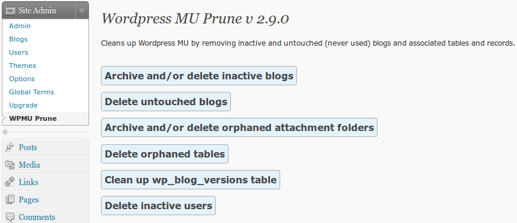
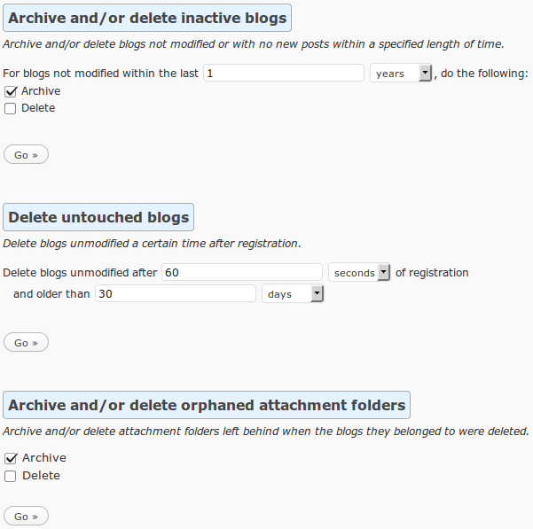
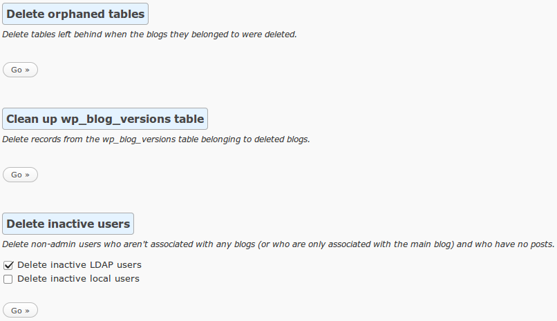
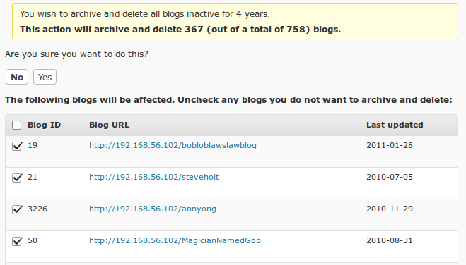

**Note:** This plugin is quite ancient and was last working with WordPress MU 2.9.2. Use at your own risk.









**Wishlist**
- Rewrite for Wordpress Multisite (instead of Wordpress MU)
- Update code to the latest version of Wordpress
- Update design to the latest version of Wordpress
- Major rewrite to clean up spaghetti code and better organize
- Add settings page to customize archive location, etc
- Add user-facing interface to restore archived blogs
- Update wording for deleting blogs "unmodified after..."
- Update number of items to apply action to using Javascript based on items checked/unchecked
- Improve AJAX functionality  
  http://codex.wordpress.org/AJAX_in_Plugins
- Create tests

**Testing**  
Until I get around to cleaning this up and writing tests, this is useful to test the functionality for deleting orphaned attachment folders:
```bash
BLOG_ROOT=/var/www/html

for i in {1..10}; do
    BLOG_ID=$(( ( RANDOM % 100 )  + 1 ))
    mkdir -p $BLOG_ROOT/wp-content/blogs.dir/$BLOG_ID/files
    touch $BLOG_ROOT/wp-content/blogs.dir/$BLOG_ID/files/test
    chown apache: -R $BLOG_ROOT/wp-content/blogs.dir/$BLOG_ID
done
```

And this is useful for testing the functionality for deleting orphaned tables:
```sql
CREATE TABLE wp_1_test (id int(10));
CREATE TABLE wp_2_test (id int(10));
CREATE TABLE wp_3_test (id int(10));
CREATE TABLE wp_4_test (id int(10));
CREATE TABLE wp_5_test (id int(10));
CREATE TABLE wp_6_test (id int(10));
CREATE TABLE wp_7_test (id int(10));
CREATE TABLE wp_8_test (id int(10));
CREATE TABLE wp_9_test (id int(10));
CREATE TABLE wp_10_test (id int(10));
```
